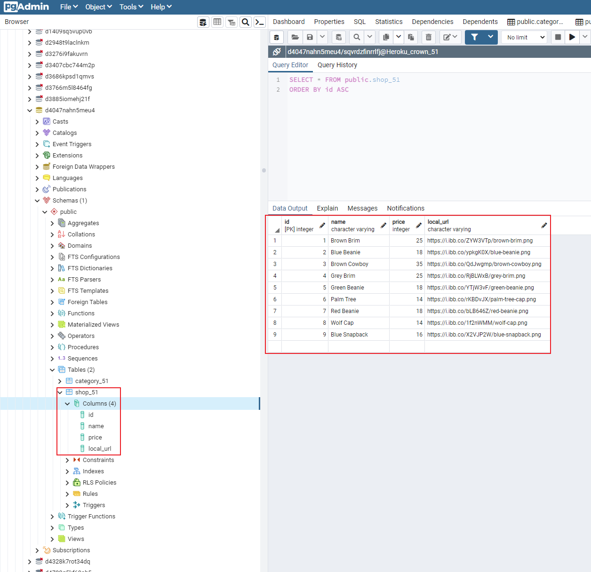
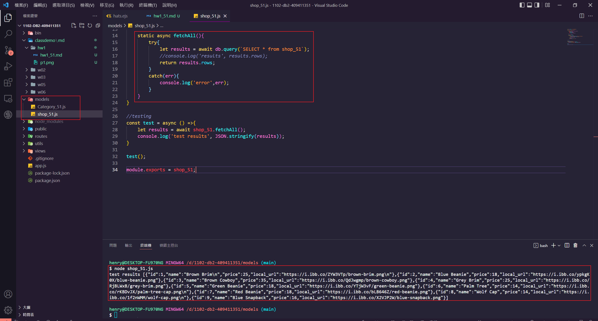
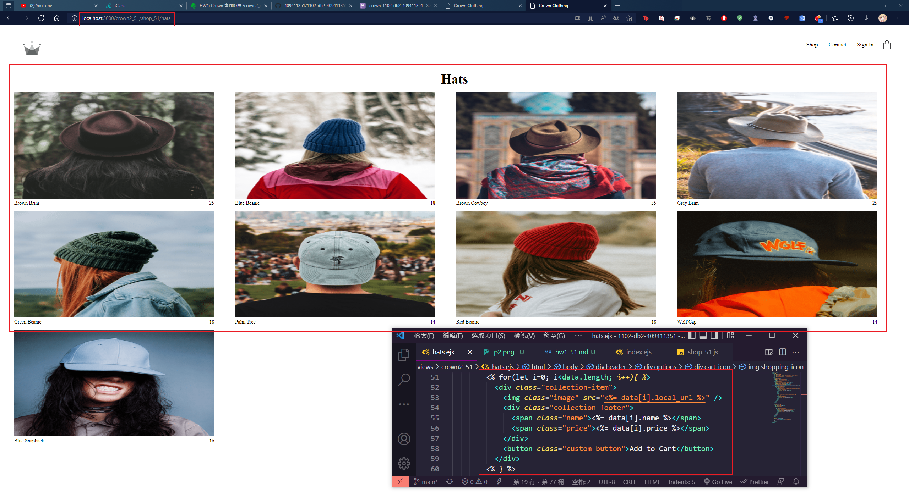
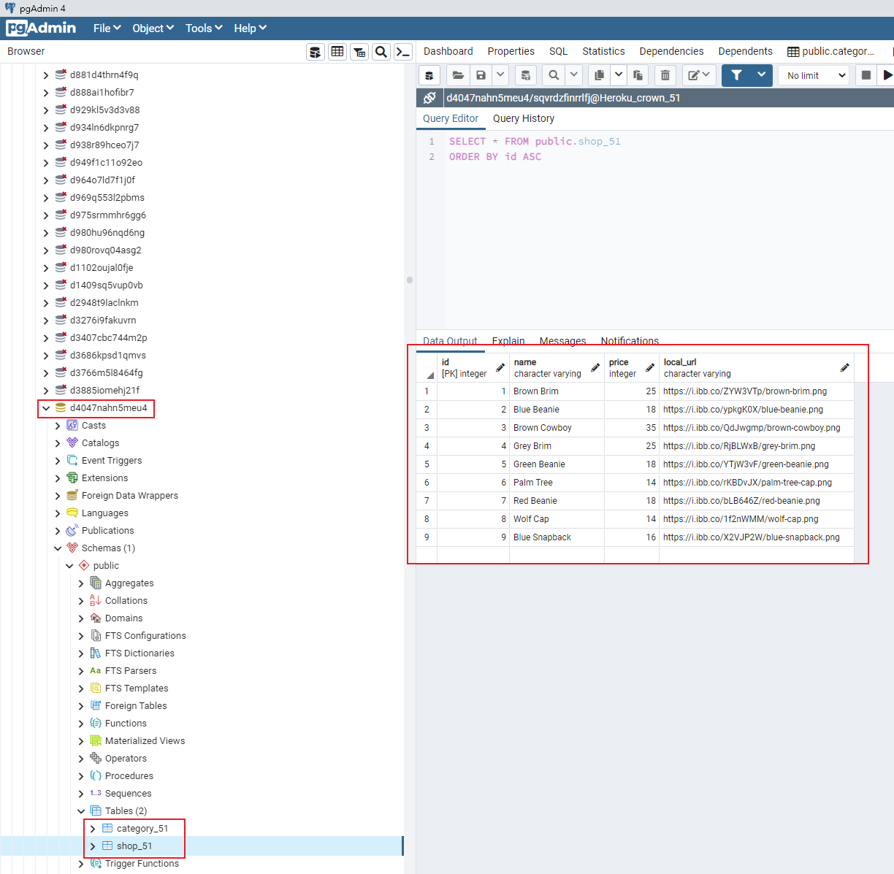

### P0: Github repo URL
https://github.com/409411351/1102-db2-409411351.git

### P1: 資料庫截圖，要能顯示 shop_xx, 及所要實作之產品 data

### P2: 實作一個 model, Shop_xx，要能從 shop_xx 取的資料，以字串顯示在 console中

### P3: 實作本作業所需要的路由，能夠將 shop_xx 資料套用在 ejs 中，請顯示 routes, ejs 程式碼及Chrome 顯示圖片

### P4: 請將資料庫放入 Heroku PostgreSQL，並能正常顯示  shop_xx, category_xx data。請給予 Heroku DATABASE_URL，截圖要有 Heroku 上 database, shop_xx 名稱及資料。
https://data.heroku.com/datastores/b44d032e-0531-4b7b-8da9-dbd514b85759#dataclips

postgres://sqvrdzfinrrlfj:
ca544980eabbbe395305c3f845c4548d2160af7af00cb360ca9f7d588728dff6@
ec2-44-192-245-97.compute-1.amazonaws.com:
5432/
d4047nahn5meu4

### P5: 在 Heroku上能正確執行本作業之路由，請提供 Heroku URL
https://dashboard.heroku.com/apps/crown-1102-db2-409411351/settings

