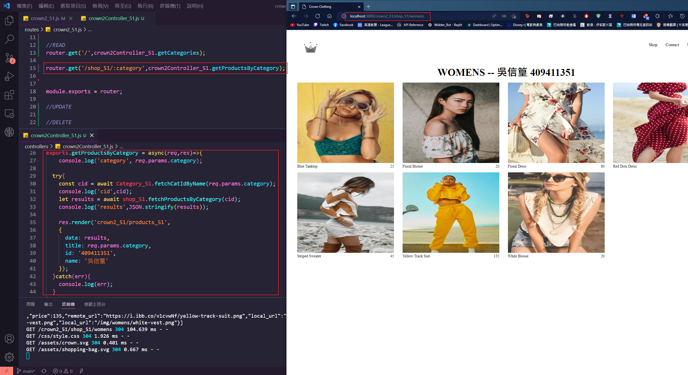
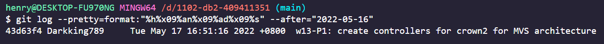
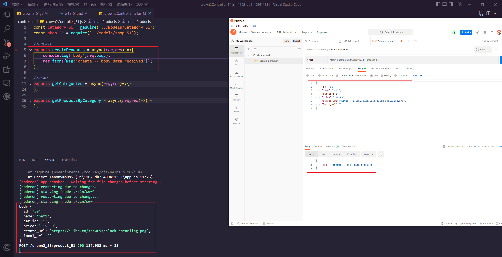
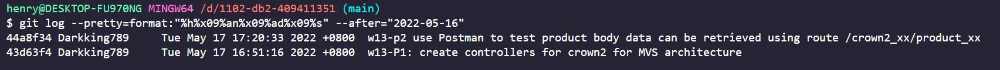

### w13-P1: create controllers for crown2 for MVS architecture





```

$ git log --pretty=format:"%h%x09%an%x09%ad%x09%s" --after="2022-05-16"
43d63f4 Darkking789     Tue May 17 16:51:16 2022 +0800  w13-P1: create controllers for crown2 for MVS architecture

```

### w13-p2 use Postman to test product body data can be retrieved using route /crown2_xx/product_xx




### w13-last-log



```

$ git log --pretty=format:"%h%x09%an%x09%ad%x09%s" --after="2022-05-16"
44a8f34 Darkking789     Tue May 17 17:20:33 2022 +0800  w13-p2 use Postman to test product body data can be retrieved using route /crown2_xx/product_xx
43d63f4 Darkking789     Tue May 17 16:51:16 2022 +0800  w13-P1: create controllers for crown2 for MVS architecture

```