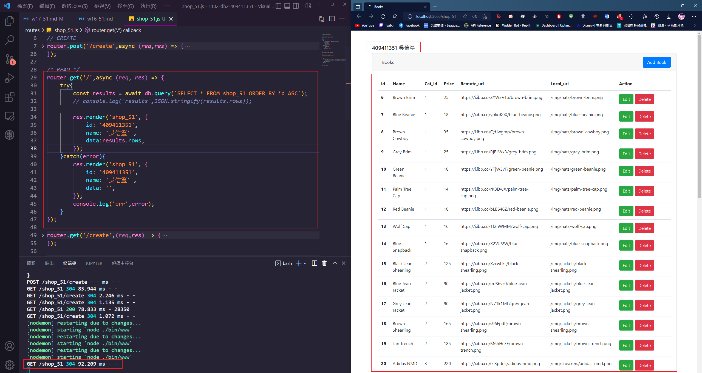
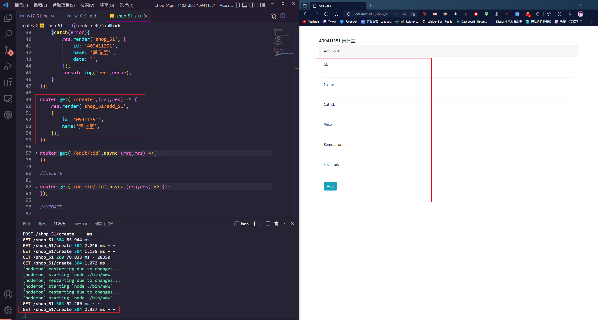
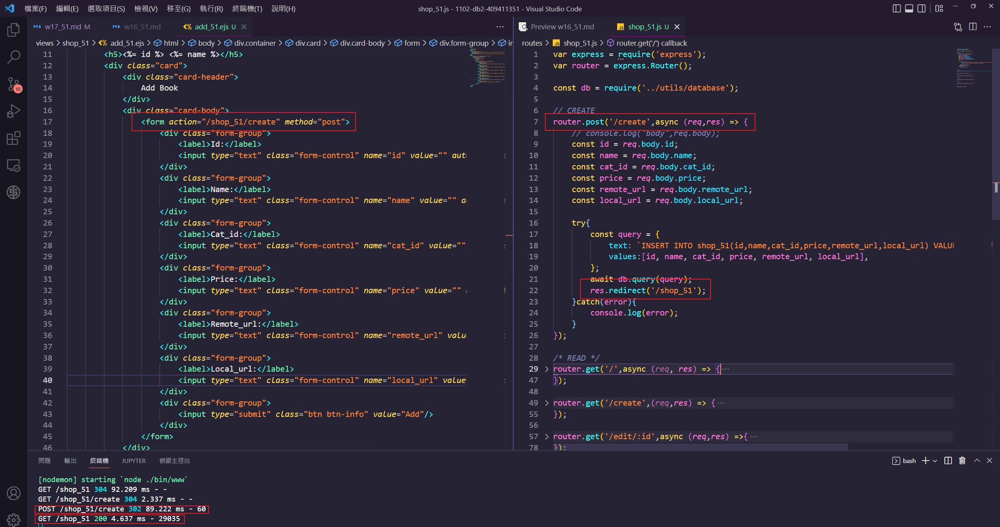
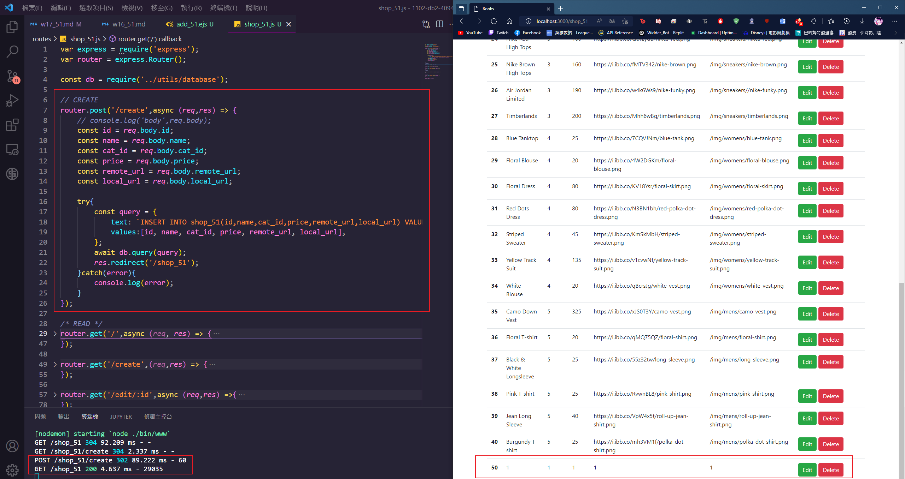
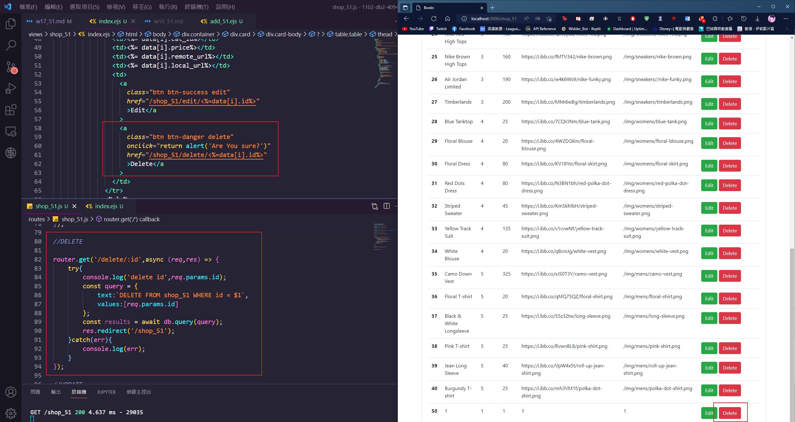
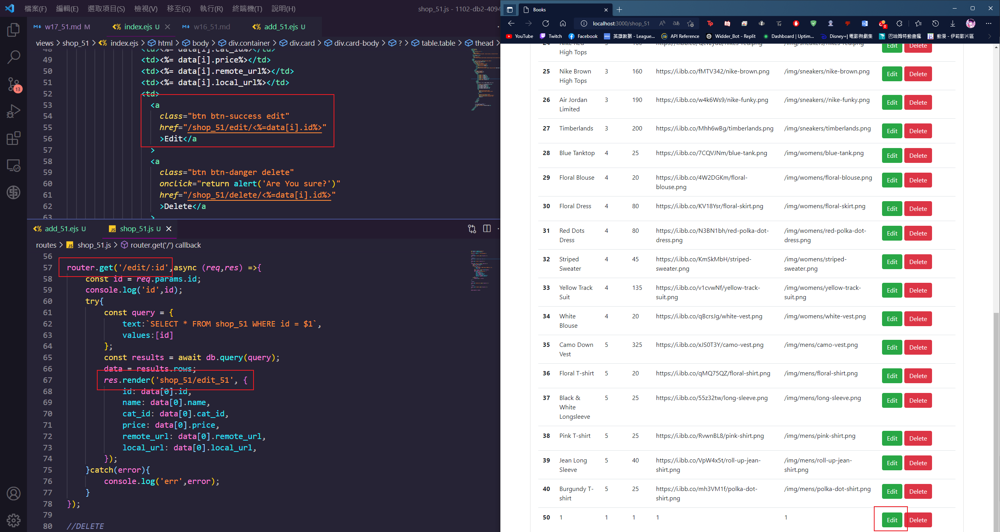
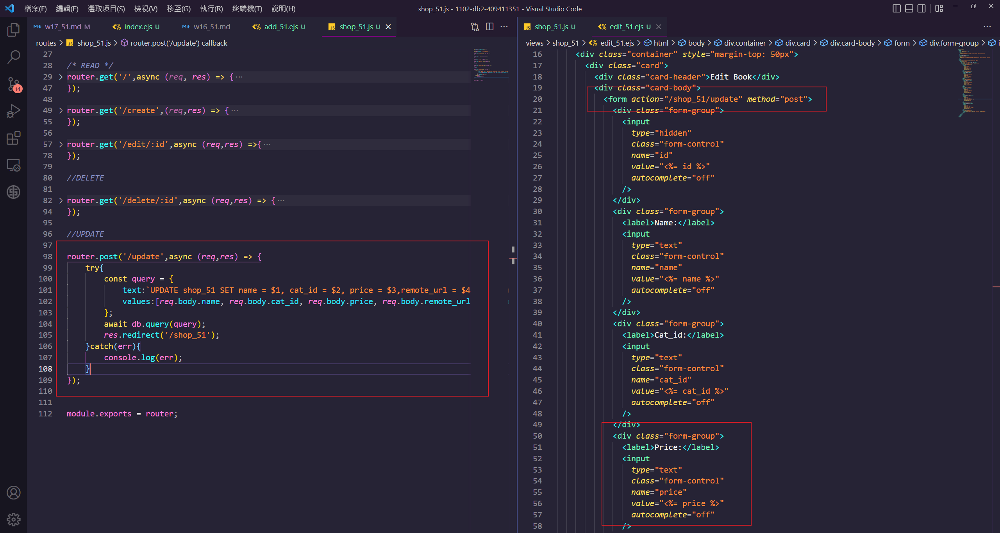

### P1: get all data from table shop_51

### P2: /shop_51/create to shop_51/add_51.ejs

### P3: POST /shop_51/create to create a book data

### P4: implement /shop_51/delete/:id

### P5: implement /shop_51/update

