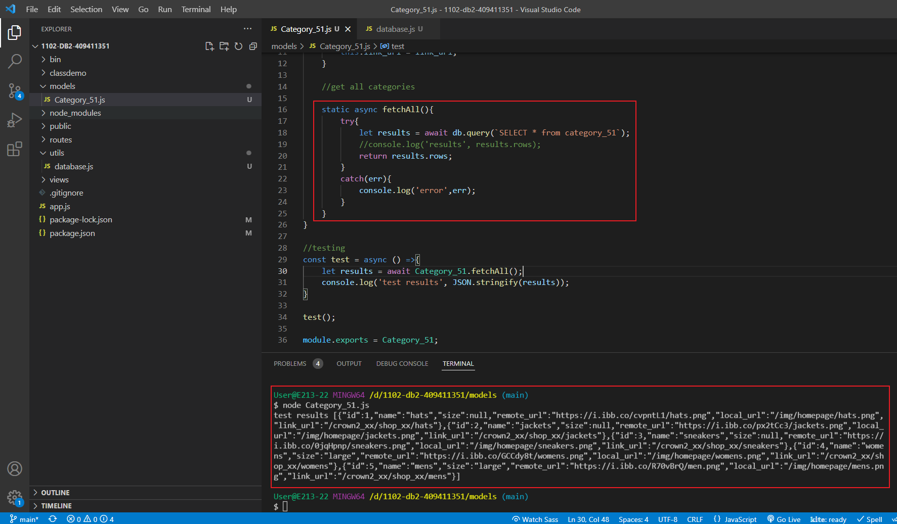
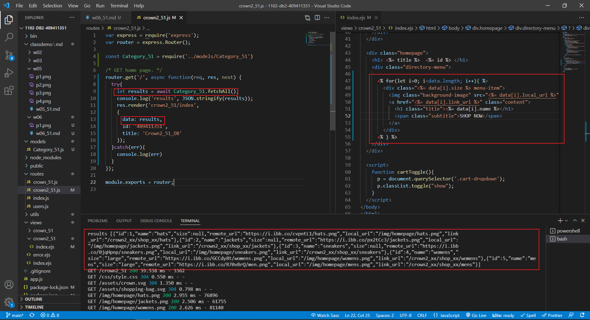

### P1:實作 /crown2_51

### p2:git push,顯示成功訊息

### p3:create database crown_51, table category_51 with 5 category data

### p4:github commit messages

### P5:create a model Category_51.js, that can fetch all data in table category_51

### P6:implement route/crown2_51,get category_51 data and put the data into crown_51/index.ejs
