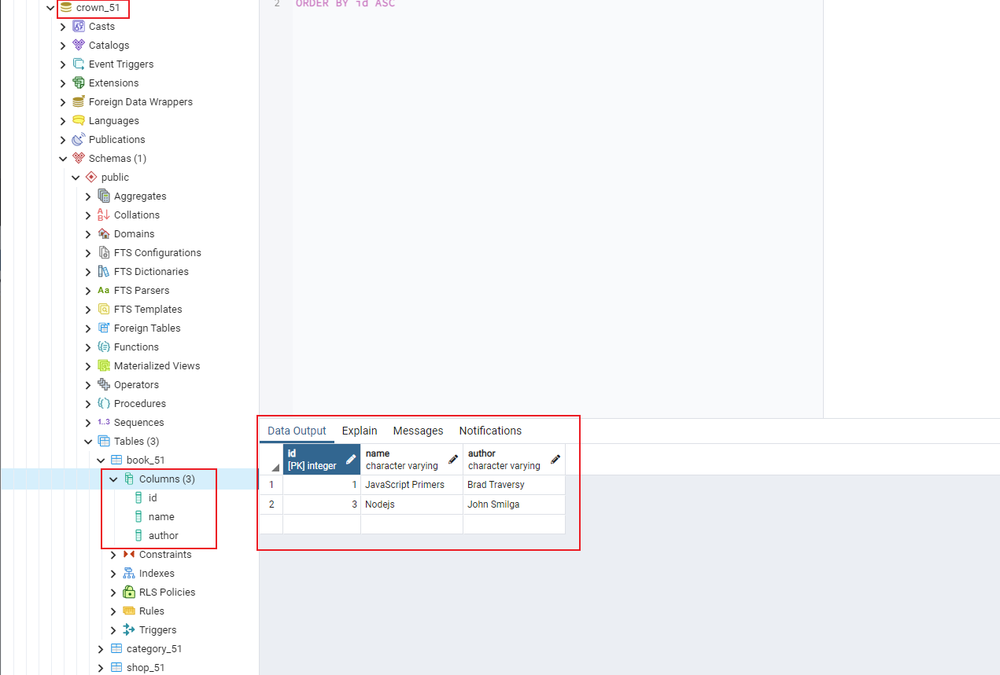
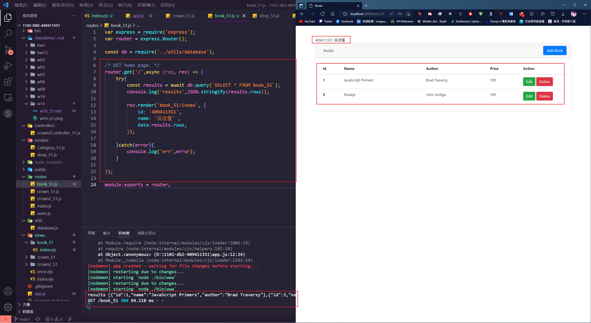
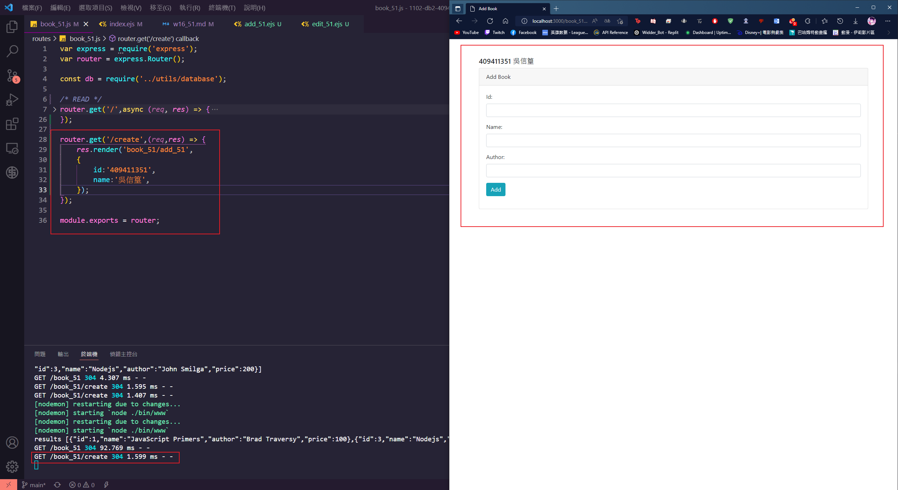
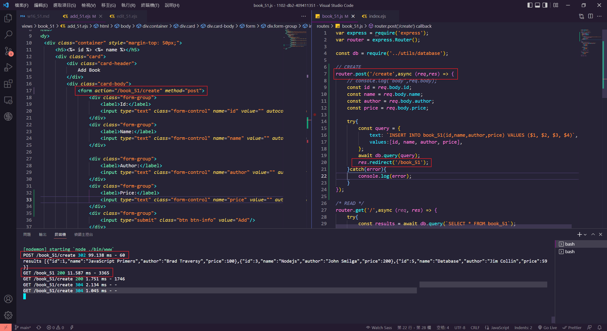
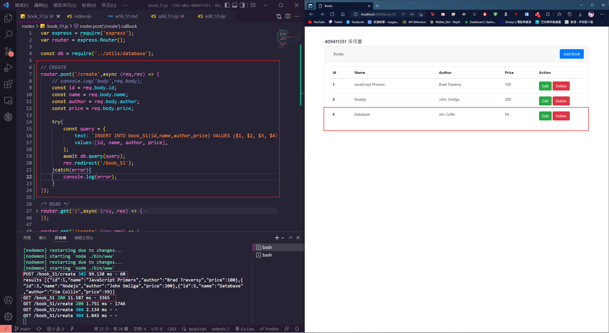

### w16-p1: create book_51 in postgreSQL server, enter two data



### w16-p2: get all data from table book_51



### w16-p3: /book_51/create to book_51/add_51.ejs



### w16-p4: POST /book_51/create to create a book data





### w16-LAST-log


```
git log --pretty=format:"%h%x09%an%x09%ad%x09%s" --after="2022-06-06"
6d3e7ed Darkking789     Tue Jun 7 17:45:54 2022 +0800   w16-p4: POST /book_51/create to create a book data
b4a8f64 Darkking789     Tue Jun 7 17:01:23 2022 +0800   w16-p3: /book_51/create to book_51/add_51.ejs
81d064a Darkking789     Tue Jun 7 16:19:06 2022 +0800   w16-p2: get all data from table book_51~
0353ca1 Darkking789     Tue Jun 7 15:46:04 2022 +0800   ### w16-p1: create book_xx in postgreSQL server, enter two data
```