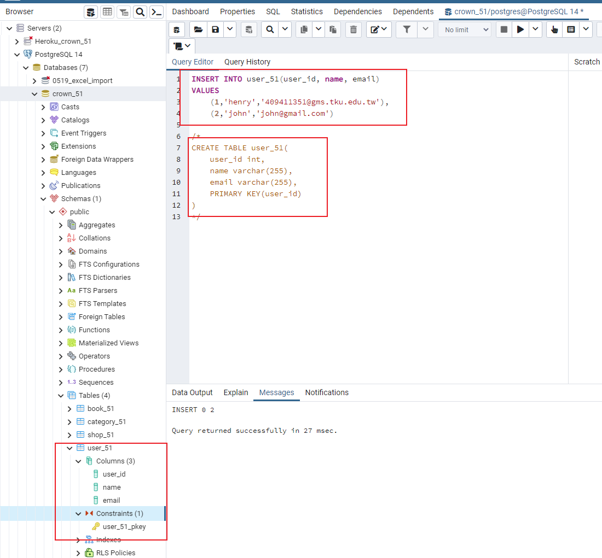
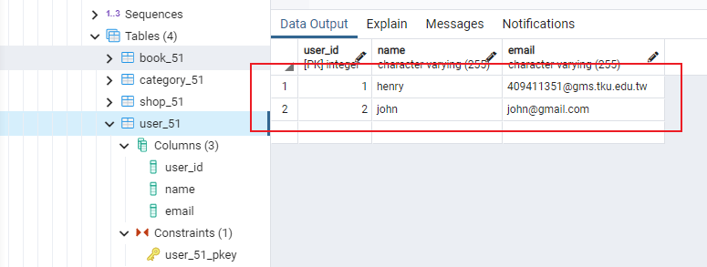
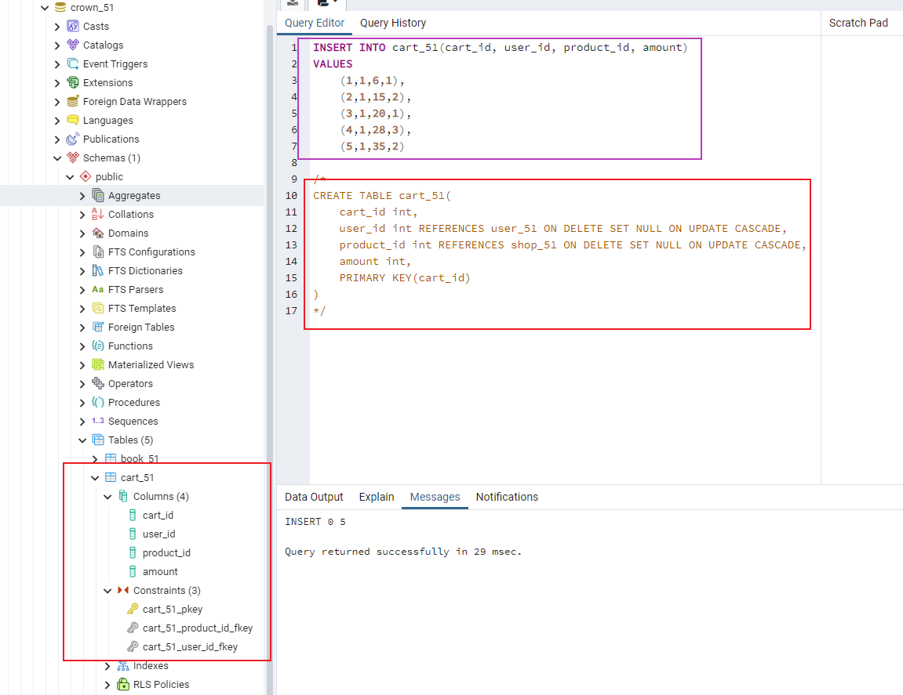
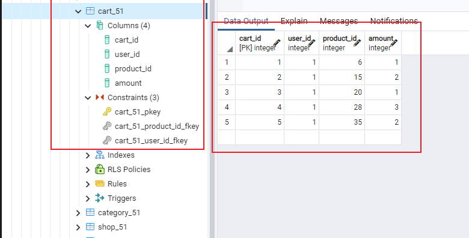
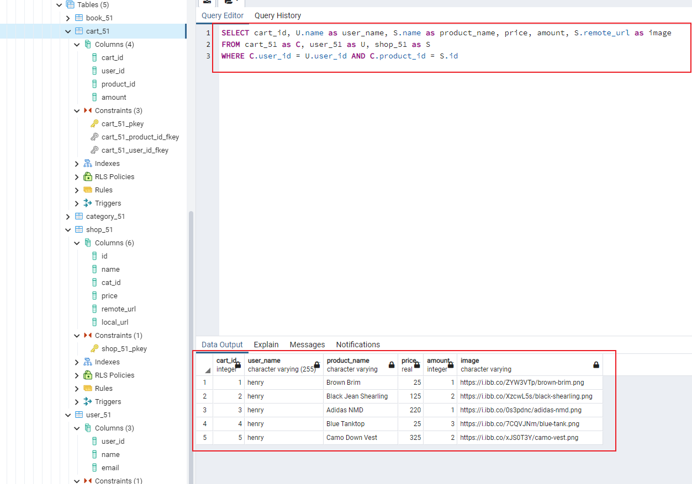
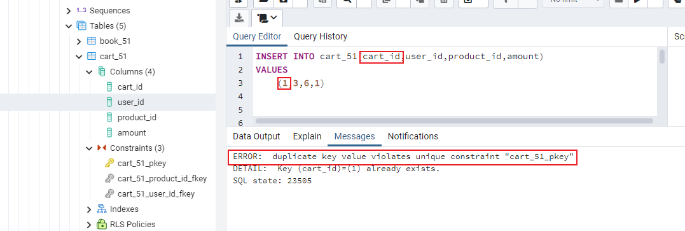
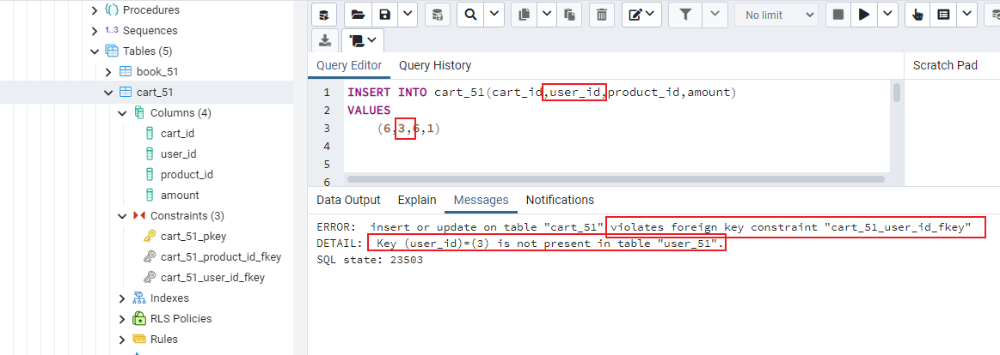
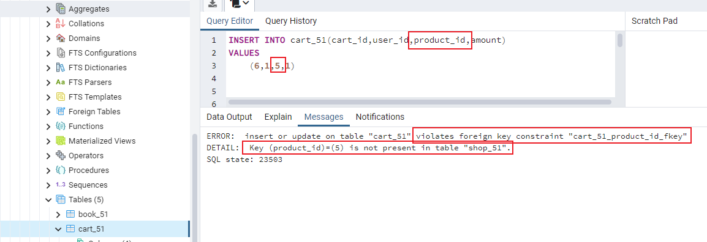

### w17-p1: create user_51 in postgreSQL server, enter two data, the first one is about your





### w17-p2: create cart_51 in postgreSQL server, enter five data, one for each category





### w17-p3: give query to get related data for cart info shown in ejs



### w17-p4: insert data in order to violate the key constraints, foreign key constraints








```
git log --pretty=format:"%h%x09%an%x09%ad%x09%s" --after="2022-06-13"
```