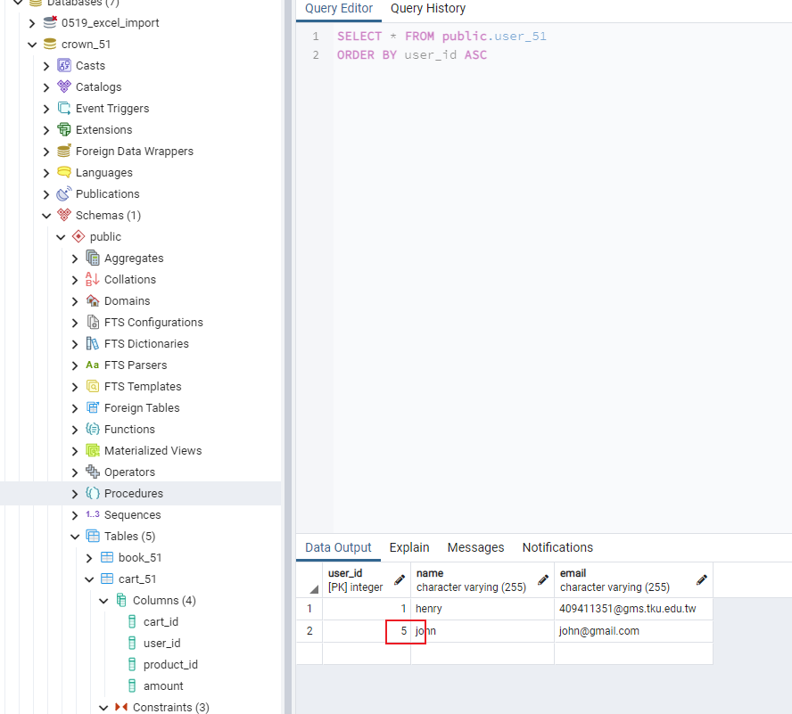
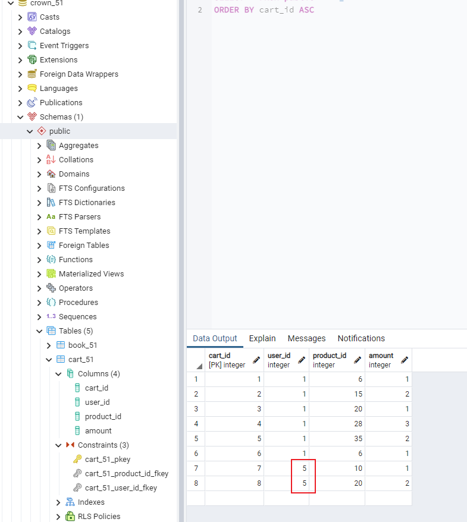
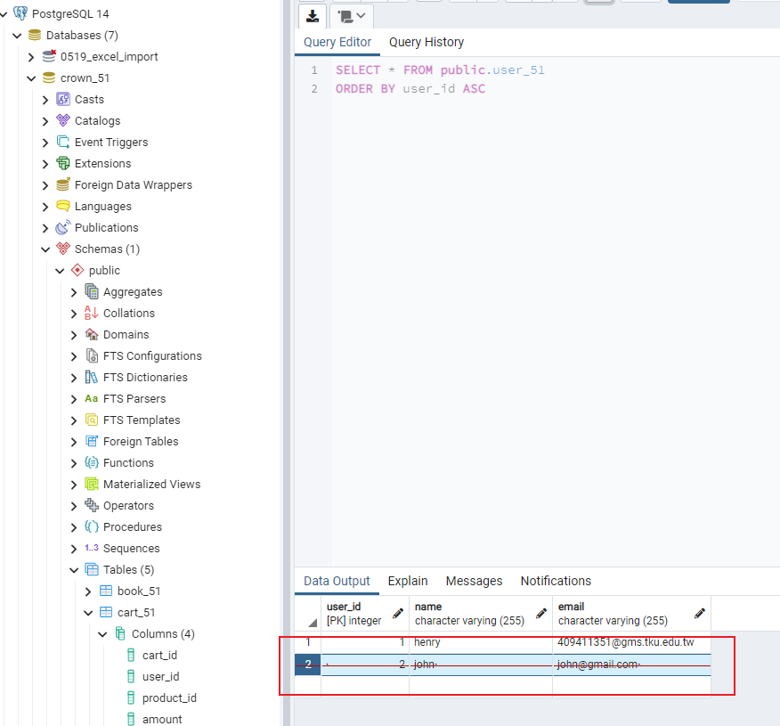
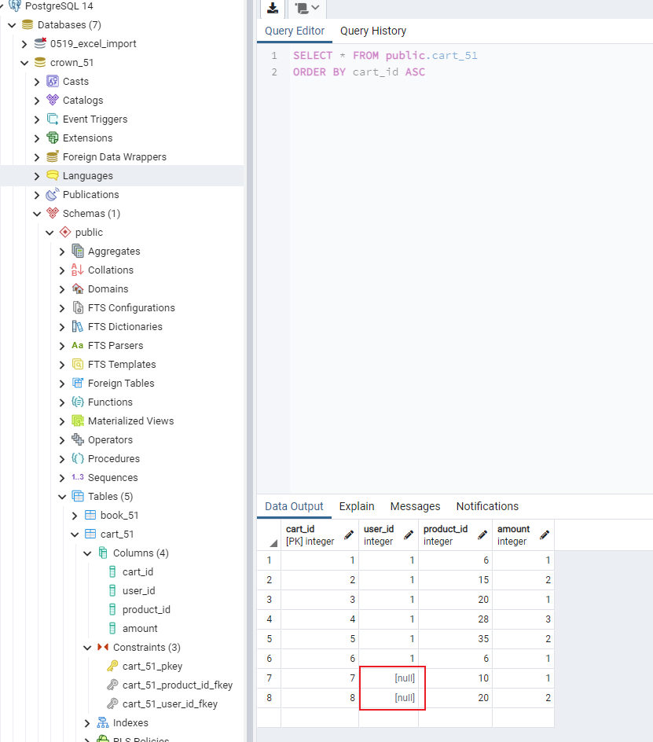
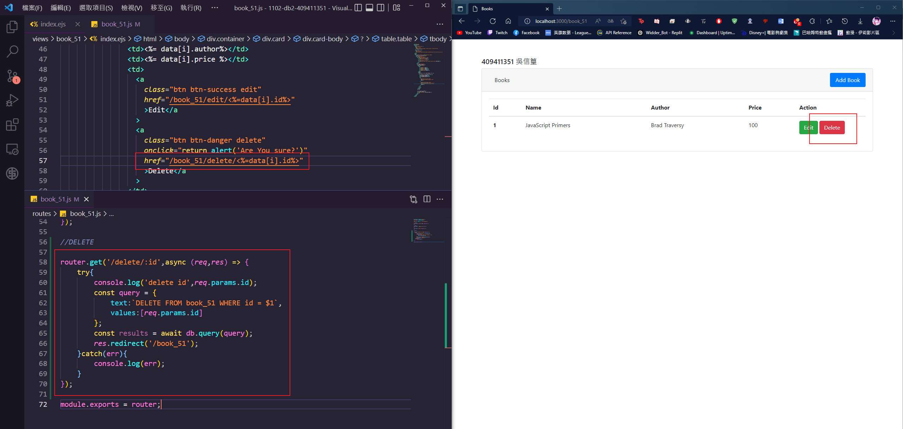
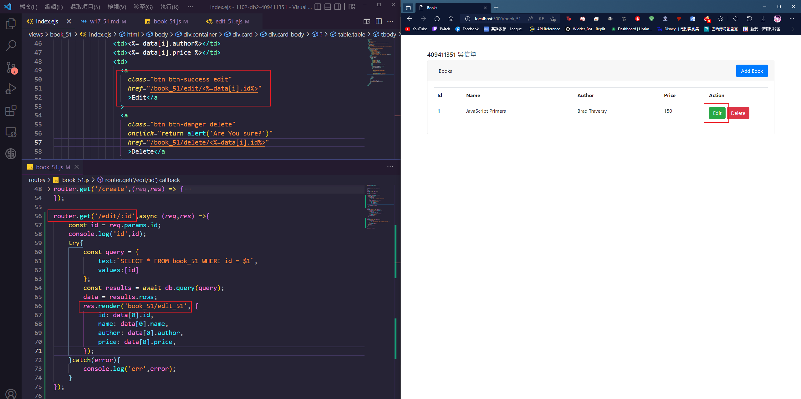
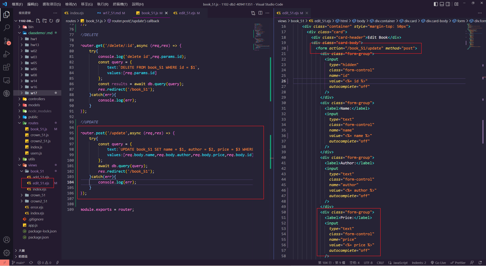
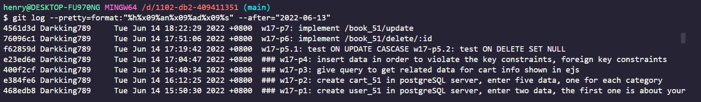

### w17-p1: create user_51 in postgreSQL server, enter two data, the first one is about your


### w17-p2: create cart_51 in postgreSQL server, enter five data, one for each category


### w17-p3: give query to get related data for cart info shown in ejs


### w17-p4: insert data in order to violate the key constraints, foreign key constraints


### w17-p5.1: test ON UPDATE CASCASE






### w17-p5.2: test ON DELETE SET NULL





### w17-p6: implement /book_51/delete/:id



### w17-p7: implement /book_51/update






### w17-LAST-log



```
git log --pretty=format:"%h%x09%an%x09%ad%x09%s" --after="2022-06-13"
4561d3d Darkking789     Tue Jun 14 18:22:29 2022 +0800  w17-p7: implement /book_51/update
76096c1 Darkking789     Tue Jun 14 17:51:06 2022 +0800  w17-p6: implement /book_51/delete/:id
f62859d Darkking789     Tue Jun 14 17:19:42 2022 +0800  w17-p5.1: test ON UPDATE CASCASE w17-p5.2: test ON DELETE SET NULL
e23ed6e Darkking789     Tue Jun 14 17:04:47 2022 +0800  ### w17-p4: insert data in order to violate the key constraints, foreign key constraints
400f2cf Darkking789     Tue Jun 14 16:40:34 2022 +0800  ### w17-p3: give query to get related data for cart info shown in ejs
e384fe6 Darkking789     Tue Jun 14 16:12:25 2022 +0800  ### w17-p2: create cart_51 in postgreSQL server, enter five data, one for each category
468edb8 Darkking789     Tue Jun 14 15:50:30 2022 +0800  ### w17-p1: create user_51 in postgreSQL server, enter two data, the first one is about your
```